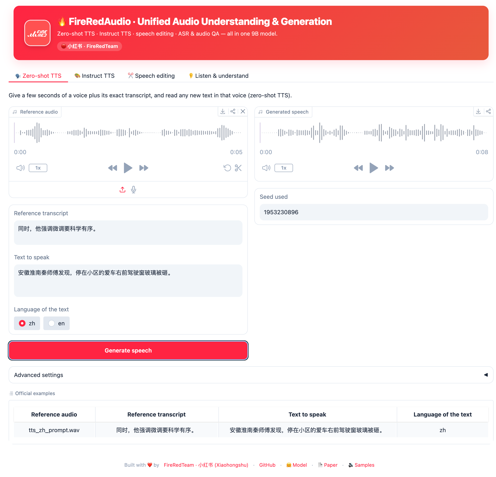

<h1>FireRedAudio</h1>
<div align="center">
    <p>
    </p>
    <p>
    Official PyTorch code for <br>
    <b><em>FireRedAudio: A General-Purpose Audio Language Model with Decoupled Continuous Representations for Understanding and Generation</em></b>
    </p>
    <p>
    </p>
    <a href="https://arxiv.org/abs/2608.24168"></a>
    <a href="https://fireredteam.github.io/demos/fireredaudio/"></a>
    <a href="https://huggingface.co/FireRedTeam/FireRedAudio"></a>
    <a href="https://www.modelscope.cn/models/FireRedTeam/FireRedAudio"></a>
    <a href="LICENSE"></a>
</div>


## Overview

> **One model to listen, understand, reason, speak, and edit.**

**FireRedAudio** is a general-purpose audio language model built on a shared **9B-parameter LLM** with **decoupled continuous representations**: an Audio Encoder handles understanding, while a RedAE pathway handles generation. A single model supports **ASR, audio understanding, zero-shot TTS, instruct TTS, semantic/acoustic speech editing, and accurate temporal grounding over recordings up to one hour long**.

<div align="center">
  
  <br>
</div>


## Highlights ✨

* 🧩 **Purpose-built representations, one shared backbone** — The Audio Encoder pathway serves understanding, while the RedAE-Patch pathway serves speech generation. Their representations remain decoupled but share the same language and reasoning backbone. To the best of our knowledge, this is the first publicly disclosed design of its kind in a unified audio-language model.
* 📊 **One model, a full audio stack** — FireRedAudio spans ASR, broad and fine-grained audio understanding, zero-shot TTS, Instruct TTS, and free-form speech editing, achieving competitive or leading results across MMAU, MMSU, Seed-TTS-Eval, InstructTTSEval, and Ming-Freeform-Audio-Edit.
* 🎙️ **Create and edit speech with natural language** — Clone a voice from a reference clip, design a voice from a description, or edit what was said and how it sounds through one continuous-latent generation pathway.
* ⏱️ **Go from minutes to hour-long recordings** — Understand recordings up to one hour with precise time-to-content alignment. Organize audio into timestamped structures, produce grounded summaries, retrieve content by time (or time by content), and reason over evidence distributed across the recording.


## Long-Audio Understanding: Time–Content Alignment Demo

<table>
  <tbody>
    <tr>
      <td width="50%">
        <video src="https://github.com/user-attachments/assets/acd36345-71e5-4c46-b828-6d4577bc24bd" controls width="100%"></video>
      </td>
      <td width="50%">
        <video src="https://github.com/user-attachments/assets/b592e6ce-d9c5-4742-86ec-488c8f496ccc" controls width="100%"></video>
      </td>
    </tr>
  </tbody>
</table>


## News

- [2026.09.08] We release a **[Gradio web demo](#web-demo-gradio)** for zero-shot TTS, instruct TTS, speech editing, ASR, and audio understanding.
- [2026.08.21] We release the **FireRedAudio** code and model.


## Contents

- [Quick Start](#quick-start-)
- [Performance](#performance)
- [Community Projects](#community-projects-)
- [Limitations](#limitations)
- [Usage Disclaimer](#usage-disclaimer)
- [Citation](#citation)
- [Acknowledgements](#acknowledgements)
- [License](#license)


## Quick Start 🚀

### Installation

Requires **Python 3.10** and [uv](https://docs.astral.sh/uv/). System prerequisites: a
**CUDA toolkit** (GPU inference + compiling the causal-conv1d / flash-attn kernels) and
**ffmpeg** (audio decoding via torchaudio/torchcodec).

Wheels target **CUDA 12.8 (`cu128`)** by default. For a different CUDA version, change the
`pytorch-cu128` index URL in [`pyproject.toml`](pyproject.toml) (e.g. `cu126` / `cu129`) and
re-run `uv sync`.

```sh
uv sync --extra accel --extra accel-build --group tools   # + compile causal-conv1d, flash-attn
```

### Model Download

Download the pretrained model from Hugging Face with the `hf` CLI:

```sh
uv run hf download FireRedTeam/FireRedAudio --local-dir pretrained_models/
```

Alternatively, download the pretrained model using `modelscope` CLI:

```sh
uv pip install modelscope
uv run modelscope download --model FireRedTeam/FireRedAudio --local_dir pretrained_models/
```

### Python API

```python
import torch
import torchaudio
from inference import FireRedAudioInference

# Init the model. Understanding tasks need only --model; generation tasks
# additionally need the RedAE decoder weights.
engine = FireRedAudioInference(
    model_path="pretrained_models/FireRedAudio",
    vae_decoder_path="pretrained_models/RedAE_decoder/model.pt",   # only for tts / edit / voice_design
    device="cuda:0",
)

# ---- 1) Speech recognition (ASR) -----------------------------------------
res = engine.understand("assets/examples/asr_zh_fleurs.wav", "Transcribe speech to text.", task="asr")
print(res.answer)

# ---- 2) Audio understanding (with optional chain-of-thought) --------------
res = engine.understand(
    "assets/examples/assets_mmau_test.wav",
    "What illness did Second speaker's friend suffer from?\n(A) Progressive arthritis (B) Progressive cancer (C) Acute pneumonia (D) Chronic heart disease",
    task="understand", enable_thinking=True, max_new_tokens=10240,
)
print("CoT:")
print(res.reasoning)   # CoT reasoning, or None
print("Answer")
print(res.answer)

# ---- 3) Zero-shot TTS (ICL voice cloning) ---------------------------------
res = engine.tts(
    prompt_text="同时，他强调微调要科学有序。",
    prompt_audio="assets/examples/tts_zh_prompt.wav",
    target_text="安徽淮南秦师傅发现，停在小区的爱车右前驾驶窗玻璃被砸。",
    language="zh",
)
torchaudio.save("tts.wav", res.audio.cpu(), sample_rate=24000)

# ---- 4) Speech editing -----------------------------------------------------
# semantic: rewrite / substitute / insert / delete content. The model first writes
#          <|sot|>{rewritten text}<|eot|> then renders the audio.
res = engine.edit("assets/examples/edit_semantic_zh_ref.wav", "delete '比普通的茶叶要'", edit_type="semantic")
print(res.text)
torchaudio.save("edit_semantic.wav", res.audio.cpu(), sample_rate=24000)

# acoustic: change pitch / speed / volume. The instruction must follow the exact
#           templates below (the model is trained on these, not free-form phrasing):
#   pitch   ->  "shift the pitch by N step(s)"       N in {-6, ..., -1, 1, ..., +6}
#   speed   ->  "adjust the speed to X"              X in [0.5, 2.0], step 0.1
#   volume  ->  "adjust the volume to X"             X in [0.3, 2.0], step 0.1
res = engine.edit("assets/examples/edit_acoustic_zh_ref.wav", "shift the pitch by 3 steps", edit_type="acoustic")
torchaudio.save("edit_acoustic.wav", res.audio.cpu(), sample_rate=24000)

# ---- 5) Voice design (synthesis from a timbre description) -----------------
res = engine.voice_design(
    instruction="以女性高音区的清亮音色,表现出青年阶段的特质,音量略强,语速适中稍快,语调带有解释意味和急切的情感流露,确保语音流畅自然。",
    text="是我请他来的，可他什么也不知道，他来只是想打听一下，你们厂是不是有旧锅炉？",
)
torchaudio.save("voice_design.wav", res.audio.cpu(), sample_rate=24000)
```

### Command Line Inference

```sh
# speech recognition
uv run inference.py --task asr --model pretrained_models/FireRedAudio --audio assets/examples/asr_zh_fleurs.wav

# audio understanding and QA; pass multiple files after one --audio
# (e.g. --audio a.wav b.wav for speaker verification).
# --enable-thinking to let the model reason first
uv run inference.py --task understand --model pretrained_models/FireRedAudio --audio assets/examples/assets_mmau_test.wav \
    --prompt "What illness did Second speaker's friend suffer from?\n(A) Progressive arthritis (B) Progressive cancer (C) Acute pneumonia (D) Chronic heart disease" --enable-thinking --max-new-tokens 4096


# ICL voice cloning from a reference audio and its transcript
uv run inference.py --task tts --model pretrained_models/FireRedAudio --vae-decoder pretrained_models/RedAE_decoder/model.pt \
    --prompt-audio assets/examples/tts_zh_prompt.wav --prompt-text "同时，他强调微调要科学有序。" \
    --target-text "安徽淮南秦师傅发现，停在小区的爱车右前驾驶窗玻璃被砸。" --language zh --output tts.wav

# speech editing; semantic rewrites content, acoustic changes pitch / speed / volume.
uv run inference.py --task edit --model pretrained_models/FireRedAudio --vae-decoder pretrained_models/RedAE_decoder/model.pt \
    --audio assets/examples/edit_semantic_zh_ref.wav --instruction "delete '比普通的茶叶要'" --edit-type semantic \
    --output edit_semantic.wav

# acoustic: instructions must use the exact trained templates, e.g.
#   "shift the pitch by N step(s)"  in  -6..6 steps        (pitch)
#   "adjust the speed to X"         in  [0.5, 2.0], step .1 (speed)
#   "adjust the volume to X"        in  [0.3, 2.0], step .1 (volume)
uv run inference.py --task edit --model pretrained_models/FireRedAudio --vae-decoder pretrained_models/RedAE_decoder/model.pt \
    --audio assets/examples/edit_acoustic_zh_ref.wav --instruction "shift the pitch by 3 steps" --edit-type acoustic \
    --output edit_acoustic.wav

# voice design
uv run inference.py --task voice_design --model pretrained_models/FireRedAudio --vae-decoder pretrained_models/RedAE_decoder/model.pt \
    --instruction "以女性高音区的清亮音色,表现出青年阶段的特质,音量略强,语速适中稍快,语调带有解释意味和急切的情感流露,确保语音流畅自然。" \
    --text "是我请他来的，可他什么也不知道，他来只是想打听一下，你们厂是不是有旧锅炉？" --output voice_design.wav
```


### Web Demo (Gradio)

<div align="center">
  
</div>

A single-file Gradio app at [`app.py`](app.py) wraps all four tasks
(zero-shot TTS · instruct TTS · speech editing · listen & understand) with the
same weights and prompt templates as the CLI. Gradio is the only extra dep on
top of the base install:

```sh
uv pip install gradio

uv run app.py \
    --model_path       pretrained_models/FireRedAudio \
    --vae_decoder_path pretrained_models/RedAE_decoder/model.pt \
    --host 0.0.0.0 --port 7860
```

Defaults to `http://0.0.0.0:7860`. The understanding tab exposes the full Qwen3
sampling controls (`temperature`, `top_p`, `top_k`, `min_p`, `repetition_penalty`,
`do_sample`) with a think-preset toggle that swaps in Qwen3's recommended
`(temperature, top_p)` for reasoning / non-reasoning modes. If you're serving
behind a reverse proxy, add `--root-path <prefix>`.


## Performance

### Audio Understanding

<div align="center">

<table style="border-collapse:collapse; margin:0 auto; text-align:center; white-space:nowrap;">
  <thead>
    <tr>
      <th align="center" style="padding:6px 14px; border:1px solid #ddd; background-color:#f5f5f5;"><div align="center">Model</div></th>
      <th align="center" style="padding:6px 14px; border:1px solid #ddd; background-color:#f5f5f5;"><div align="center">MMAU test-mini</div></th>
      <th align="center" style="padding:6px 14px; border:1px solid #ddd; background-color:#f5f5f5;"><div align="center">MMAU test</div></th>
      <th align="center" style="padding:6px 14px; border:1px solid #ddd; background-color:#f5f5f5;"><div align="center">MMSU</div></th>
    </tr>
  </thead>
  <tbody>
    <tr><td align="center" style="padding:6px 14px; border:1px solid #ddd;">Step-Audio-R1.1</td><td align="center" style="padding:6px 14px; border:1px solid #ddd;">77.7</td><td align="center" style="padding:6px 14px; border:1px solid #ddd;">–</td><td align="center" style="padding:6px 14px; border:1px solid #ddd;">75.9</td></tr>
    <tr><td align="center" style="padding:6px 14px; border:1px solid #ddd;">Step-Audio 2</td><td align="center" style="padding:6px 14px; border:1px solid #ddd;">78.0</td><td align="center" style="padding:6px 14px; border:1px solid #ddd;">–</td><td align="center" style="padding:6px 14px; border:1px solid #ddd;">–</td></tr>
    <tr><td align="center" style="padding:6px 14px; border:1px solid #ddd;">MiMo-Audio-7B-Instruct</td><td align="center" style="padding:6px 14px; border:1px solid #ddd;">74.9</td><td align="center" style="padding:6px 14px; border:1px solid #ddd;">–</td><td align="center" style="padding:6px 14px; border:1px solid #ddd;">61.7</td></tr>
    <tr><td align="center" style="padding:6px 14px; border:1px solid #ddd;">Kimi-Audio</td><td align="center" style="padding:6px 14px; border:1px solid #ddd;">65.2</td><td align="center" style="padding:6px 14px; border:1px solid #ddd;">–</td><td align="center" style="padding:6px 14px; border:1px solid #ddd;">–</td></tr>
    <tr><td align="center" style="padding:6px 14px; border:1px solid #ddd;">LongCat-Next</td><td align="center" style="padding:6px 14px; border:1px solid #ddd;">76.4</td><td align="center" style="padding:6px 14px; border:1px solid #ddd;">–</td><td align="center" style="padding:6px 14px; border:1px solid #ddd;">–</td></tr>
    <tr><td align="center" style="padding:6px 14px; border:1px solid #ddd;">Qwen3-Omni-30B-A3B-Instruct</td><td align="center" style="padding:6px 14px; border:1px solid #ddd;">77.5</td><td align="center" style="padding:6px 14px; border:1px solid #ddd;">–</td><td align="center" style="padding:6px 14px; border:1px solid #ddd;">69.0</td></tr>
    <tr><td align="center" style="padding:6px 14px; border:1px solid #ddd;">Gemini 3.1 Pro</td><td align="center" style="padding:6px 14px; border:1px solid #ddd;">80.7*</td><td align="center" style="padding:6px 14px; border:1px solid #ddd;">78.8*</td><td align="center" style="padding:6px 14px; border:1px solid #ddd;">82.7*</td></tr>
    <tr><td align="center" style="padding:6px 14px; border:1px solid #ddd;">Qwen3.5-Omni-Plus</td><td align="center" style="padding:6px 14px; border:1px solid #ddd;">81.4*</td><td align="center" style="padding:6px 14px; border:1px solid #ddd;">79.9*</td><td align="center" style="padding:6px 14px; border:1px solid #ddd;">80.7*</td></tr>
    <tr><td align="center" style="padding:6px 14px; border:1px solid #ddd;"><b>FireRedAudio</b></td><td align="center" style="padding:6px 14px; border:1px solid #ddd;"><b>82.0</b></td><td align="center" style="padding:6px 14px; border:1px solid #ddd;"><b>80.9</b></td><td align="center" style="padding:6px 14px; border:1px solid #ddd;"><b>83.3</b></td></tr>
  </tbody>
</table>

</div>

* *Results marked with * are obtained from our own evaluation.*

### ASR

<div align="center">

<table style="border-collapse:collapse; margin:0 auto; text-align:center; white-space:nowrap;">
  <thead>
    <tr>
      <th align="center" style="padding:6px 12px; border:1px solid #ddd; background-color:#f5f5f5;"><div align="center">Model</div></th>
      <th align="center" style="padding:6px 12px; border:1px solid #ddd; background-color:#f5f5f5;"><div align="center">AISHELL&#8209;1</div></th>
      <th align="center" style="padding:6px 12px; border:1px solid #ddd; background-color:#f5f5f5;"><div align="center">AISHELL&#8209;2<br>test&#8209;ios</div></th>
      <th align="center" style="padding:6px 12px; border:1px solid #ddd; background-color:#f5f5f5;"><div align="center">WenetSpeech<br>Net&nbsp;&#8288;|&#8288;&nbsp;Meeting</div></th>
      <th align="center" style="padding:6px 12px; border:1px solid #ddd; background-color:#f5f5f5;"><div align="center">LibriSpeech<br>clean&nbsp;&#8288;|&#8288;&nbsp;other</div></th>
      <th align="center" style="padding:6px 12px; border:1px solid #ddd; background-color:#f5f5f5;"><div align="center">FLEURS<br>en&nbsp;&#8288;|&#8288;&nbsp;zh</div></th>
      <th align="center" style="padding:6px 12px; border:1px solid #ddd; background-color:#f5f5f5;"><div align="center">FLEURS&#8209;102<br>avg</div></th>
      <th align="center" style="padding:6px 12px; border:1px solid #ddd; background-color:#f5f5f5;"><div align="center">KeSpeech</div></th>
      <th align="center" style="padding:6px 12px; border:1px solid #ddd; background-color:#f5f5f5;"><div align="center">Opencpop</div></th>
    </tr>
  </thead>
  <tbody>
    <tr><td align="center" style="padding:6px 12px; border:1px solid #ddd;">Step&#8209;Audio&nbsp;2</td><td align="center" style="padding:6px 12px; border:1px solid #ddd;">0.63</td><td align="center" style="padding:6px 12px; border:1px solid #ddd;">2.10</td><td align="center" style="padding:6px 12px; border:1px solid #ddd;">4.67&nbsp;&#8288;|&#8288;&nbsp;4.75</td><td align="center" style="padding:6px 12px; border:1px solid #ddd;">1.17&nbsp;&#8288;|&#8288;&nbsp;2.42</td><td align="center" style="padding:6px 12px; border:1px solid #ddd;">3.03&nbsp;&#8288;|&#8288;&nbsp;2.68</td><td align="center" style="padding:6px 12px; border:1px solid #ddd;">–</td><td align="center" style="padding:6px 12px; border:1px solid #ddd;">3.63</td><td align="center" style="padding:6px 12px; border:1px solid #ddd;">–</td></tr>
    <tr><td align="center" style="padding:6px 12px; border:1px solid #ddd;">MiMo&#8209;Audio&#8209;7B&#8209;Instruct</td><td align="center" style="padding:6px 12px; border:1px solid #ddd;">1.65</td><td align="center" style="padding:6px 12px; border:1px solid #ddd;">–</td><td align="center" style="padding:6px 12px; border:1px solid #ddd;">–</td><td align="center" style="padding:6px 12px; border:1px solid #ddd;">3.50&nbsp;&#8288;|&#8288;&nbsp;–</td><td align="center" style="padding:6px 12px; border:1px solid #ddd;">–</td><td align="center" style="padding:6px 12px; border:1px solid #ddd;">–</td><td align="center" style="padding:6px 12px; border:1px solid #ddd;">–</td><td align="center" style="padding:6px 12px; border:1px solid #ddd;">–</td></tr>
    <tr><td align="center" style="padding:6px 12px; border:1px solid #ddd;">Ming&#8209;UniAudio&#8209;16B&#8209;A3B</td><td align="center" style="padding:6px 12px; border:1px solid #ddd;">–</td><td align="center" style="padding:6px 12px; border:1px solid #ddd;">2.84</td><td align="center" style="padding:6px 12px; border:1px solid #ddd;">–</td><td align="center" style="padding:6px 12px; border:1px solid #ddd;">1.62&nbsp;&#8288;|&#8288;&nbsp;–</td><td align="center" style="padding:6px 12px; border:1px solid #ddd;">–</td><td align="center" style="padding:6px 12px; border:1px solid #ddd;">–</td><td align="center" style="padding:6px 12px; border:1px solid #ddd;">–</td><td align="center" style="padding:6px 12px; border:1px solid #ddd;">–</td></tr>
    <tr><td align="center" style="padding:6px 12px; border:1px solid #ddd;">Kimi&#8209;Audio</td><td align="center" style="padding:6px 12px; border:1px solid #ddd;">0.60</td><td align="center" style="padding:6px 12px; border:1px solid #ddd;">2.56</td><td align="center" style="padding:6px 12px; border:1px solid #ddd;">5.37&nbsp;&#8288;|&#8288;&nbsp;6.28</td><td align="center" style="padding:6px 12px; border:1px solid #ddd;">1.28&nbsp;&#8288;|&#8288;&nbsp;2.42</td><td align="center" style="padding:6px 12px; border:1px solid #ddd;">4.44&nbsp;&#8288;|&#8288;&nbsp;2.69</td><td align="center" style="padding:6px 12px; border:1px solid #ddd;">–</td><td align="center" style="padding:6px 12px; border:1px solid #ddd;">–</td><td align="center" style="padding:6px 12px; border:1px solid #ddd;">–</td></tr>
    <tr><td align="center" style="padding:6px 12px; border:1px solid #ddd;">LongCat&#8209;Next</td><td align="center" style="padding:6px 12px; border:1px solid #ddd;">1.47</td><td align="center" style="padding:6px 12px; border:1px solid #ddd;">2.82</td><td align="center" style="padding:6px 12px; border:1px solid #ddd;">5.98&nbsp;&#8288;|&#8288;&nbsp;8.19</td><td align="center" style="padding:6px 12px; border:1px solid #ddd;">1.63&nbsp;&#8288;|&#8288;&nbsp;3.42</td><td align="center" style="padding:6px 12px; border:1px solid #ddd;">5.24&nbsp;&#8288;|&#8288;&nbsp;3.24</td><td align="center" style="padding:6px 12px; border:1px solid #ddd;">–</td><td align="center" style="padding:6px 12px; border:1px solid #ddd;">–</td><td align="center" style="padding:6px 12px; border:1px solid #ddd;">–</td></tr>
    <tr><td align="center" style="padding:6px 12px; border:1px solid #ddd;">Qwen3&#8209;Omni&#8209;30B&#8209;A3B&#8209;Instruct</td><td align="center" style="padding:6px 12px; border:1px solid #ddd;">–</td><td align="center" style="padding:6px 12px; border:1px solid #ddd;">–</td><td align="center" style="padding:6px 12px; border:1px solid #ddd;">4.69&nbsp;&#8288;|&#8288;&nbsp;5.89</td><td align="center" style="padding:6px 12px; border:1px solid #ddd;">1.22&nbsp;&#8288;|&#8288;&nbsp;2.48</td><td align="center" style="padding:6px 12px; border:1px solid #ddd;">2.72&nbsp;&#8288;|&#8288;&nbsp;2.20</td><td align="center" style="padding:6px 12px; border:1px solid #ddd;">–</td><td align="center" style="padding:6px 12px; border:1px solid #ddd;">–</td><td align="center" style="padding:6px 12px; border:1px solid #ddd;">1.54</td></tr>
    <tr><td align="center" style="padding:6px 12px; border:1px solid #ddd;">Gemini&nbsp;3.1&nbsp;Pro</td><td align="center" style="padding:6px 12px; border:1px solid #ddd;">3.66*</td><td align="center" style="padding:6px 12px; border:1px solid #ddd;">7.10*</td><td align="center" style="padding:6px 12px; border:1px solid #ddd;">11.53&nbsp;&#8288;|&#8288;&nbsp;14.21</td><td align="center" style="padding:6px 12px; border:1px solid #ddd;">3.36&nbsp;&#8288;|&#8288;&nbsp;4.41</td><td align="center" style="padding:6px 12px; border:1px solid #ddd;">2.97*&nbsp;&#8288;|&#8288;&nbsp;4.28*</td><td align="center" style="padding:6px 12px; border:1px solid #ddd;">18.23*</td><td align="center" style="padding:6px 12px; border:1px solid #ddd;">23.67</td><td align="center" style="padding:6px 12px; border:1px solid #ddd;">6.83</td></tr>
    <tr><td align="center" style="padding:6px 12px; border:1px solid #ddd;">Qwen3.5&#8209;Omni&#8209;Plus</td><td align="center" style="padding:6px 12px; border:1px solid #ddd;">0.82*</td><td align="center" style="padding:6px 12px; border:1px solid #ddd;">2.26*</td><td align="center" style="padding:6px 12px; border:1px solid #ddd;">4.30&nbsp;&#8288;|&#8288;&nbsp;5.84</td><td align="center" style="padding:6px 12px; border:1px solid #ddd;">1.11&nbsp;&#8288;|&#8288;&nbsp;2.23</td><td align="center" style="padding:6px 12px; border:1px solid #ddd;">3.33*&nbsp;&#8288;|&#8288;&nbsp;2.46*</td><td align="center" style="padding:6px 12px; border:1px solid #ddd;">23.66*</td><td align="center" style="padding:6px 12px; border:1px solid #ddd;">3.46</td><td align="center" style="padding:6px 12px; border:1px solid #ddd;">1.49</td></tr>
    <tr><td align="center" style="padding:6px 12px; border:1px solid #ddd;"><b>FireRedAudio</b></td><td align="center" style="padding:6px 12px; border:1px solid #ddd;">0.71</td><td align="center" style="padding:6px 12px; border:1px solid #ddd;">2.63</td><td align="center" style="padding:6px 12px; border:1px solid #ddd;">5.18&nbsp;&#8288;|&#8288;&nbsp;5.33</td><td align="center" style="padding:6px 12px; border:1px solid #ddd;">0.67&nbsp;&#8288;|&#8288;&nbsp;2.91</td><td align="center" style="padding:6px 12px; border:1px solid #ddd;">2.53&nbsp;&#8288;|&#8288;&nbsp;3.14</td><td align="center" style="padding:6px 12px; border:1px solid #ddd;">14.94</td><td align="center" style="padding:6px 12px; border:1px solid #ddd;">4.82</td><td align="center" style="padding:6px 12px; border:1px solid #ddd;">1.63</td></tr>
  </tbody>
</table>

</div>

* *Results marked with * are obtained from our own evaluation.*

### Zero-Shot TTS

<div align="center">

<table align="center" style="border-collapse:collapse; margin:0 auto; text-align:center; white-space:nowrap;">
  <thead>
    <tr>
      <th align="center" style="padding:6px 14px; border:1px solid #ddd; background-color:#f5f5f5;"><div align="center">Model</div></th>
      <th align="center" style="padding:6px 14px; border:1px solid #ddd; background-color:#f5f5f5;"><div align="center">Seed-ZH<br>CER↓&nbsp;&#8288;|&#8288;&nbsp;SIM↑</div></th>
      <th align="center" style="padding:6px 14px; border:1px solid #ddd; background-color:#f5f5f5;"><div align="center">Seed-EN<br>WER↓&nbsp;&#8288;|&#8288;&nbsp;SIM↑</div></th>
      <th align="center" style="padding:6px 14px; border:1px solid #ddd; background-color:#f5f5f5;"><div align="center">Avg.<br>CER/WER↓&nbsp;&#8288;|&#8288;&nbsp;SIM↑</div></th>
    </tr>
  </thead>
  <tbody>
    <tr><td align="center" style="padding:6px 14px; border:1px solid #ddd;">Seed-TTS</td><td align="center" style="padding:6px 14px; border:1px solid #ddd;">1.12&nbsp;&#8288;|&#8288;&nbsp;<b>0.80</b></td><td align="center" style="padding:6px 14px; border:1px solid #ddd;">2.25&nbsp;&#8288;|&#8288;&nbsp;<b>0.76</b></td><td align="center" style="padding:6px 14px; border:1px solid #ddd;">1.69&nbsp;&#8288;|&#8288;&nbsp;<b>0.78</b></td></tr>
    <tr><td align="center" style="padding:6px 14px; border:1px solid #ddd;">FireRedTTS</td><td align="center" style="padding:6px 14px; border:1px solid #ddd;">1.51&nbsp;&#8288;|&#8288;&nbsp;0.65</td><td align="center" style="padding:6px 14px; border:1px solid #ddd;">3.82&nbsp;&#8288;|&#8288;&nbsp;0.53</td><td align="center" style="padding:6px 14px; border:1px solid #ddd;">2.67&nbsp;&#8288;|&#8288;&nbsp;0.59</td></tr>
    <tr><td align="center" style="padding:6px 14px; border:1px solid #ddd;">FireRedTTS-2</td><td align="center" style="padding:6px 14px; border:1px solid #ddd;">1.14&nbsp;&#8288;|&#8288;&nbsp;0.74</td><td align="center" style="padding:6px 14px; border:1px solid #ddd;">1.95&nbsp;&#8288;|&#8288;&nbsp;0.65</td><td align="center" style="padding:6px 14px; border:1px solid #ddd;">1.55&nbsp;&#8288;|&#8288;&nbsp;0.69</td></tr>
    <tr><td align="center" style="padding:6px 14px; border:1px solid #ddd;">DiTAR (1B)</td><td align="center" style="padding:6px 14px; border:1px solid #ddd;">1.02&nbsp;&#8288;|&#8288;&nbsp;0.75</td><td align="center" style="padding:6px 14px; border:1px solid #ddd;">1.69&nbsp;&#8288;|&#8288;&nbsp;<ins>0.74</ins></td><td align="center" style="padding:6px 14px; border:1px solid #ddd;">1.36&nbsp;&#8288;|&#8288;&nbsp;<ins>0.75</ins></td></tr>
    <tr><td align="center" style="padding:6px 14px; border:1px solid #ddd;">F5-TTS</td><td align="center" style="padding:6px 14px; border:1px solid #ddd;">1.56&nbsp;&#8288;|&#8288;&nbsp;0.74</td><td align="center" style="padding:6px 14px; border:1px solid #ddd;">1.83&nbsp;&#8288;|&#8288;&nbsp;0.65</td><td align="center" style="padding:6px 14px; border:1px solid #ddd;">1.70&nbsp;&#8288;|&#8288;&nbsp;0.70</td></tr>
    <tr><td align="center" style="padding:6px 14px; border:1px solid #ddd;">CosyVoice 2</td><td align="center" style="padding:6px 14px; border:1px solid #ddd;">1.45&nbsp;&#8288;|&#8288;&nbsp;0.75</td><td align="center" style="padding:6px 14px; border:1px solid #ddd;">2.57&nbsp;&#8288;|&#8288;&nbsp;0.65</td><td align="center" style="padding:6px 14px; border:1px solid #ddd;">2.01&nbsp;&#8288;|&#8288;&nbsp;0.70</td></tr>
    <tr><td align="center" style="padding:6px 14px; border:1px solid #ddd;">CosyVoice 3-1.5B</td><td align="center" style="padding:6px 14px; border:1px solid #ddd;">1.12&nbsp;&#8288;|&#8288;&nbsp;<ins>0.78</ins></td><td align="center" style="padding:6px 14px; border:1px solid #ddd;">2.21&nbsp;&#8288;|&#8288;&nbsp;0.72</td><td align="center" style="padding:6px 14px; border:1px solid #ddd;">1.67&nbsp;&#8288;|&#8288;&nbsp;<ins>0.75</ins></td></tr>
    <tr><td align="center" style="padding:6px 14px; border:1px solid #ddd;">MiMo-Audio-7B-Instruct</td><td align="center" style="padding:6px 14px; border:1px solid #ddd;">1.96&nbsp;&#8288;|&#8288;&nbsp;–</td><td align="center" style="padding:6px 14px; border:1px solid #ddd;">5.37&nbsp;&#8288;|&#8288;&nbsp;–</td><td align="center" style="padding:6px 14px; border:1px solid #ddd;">3.67&nbsp;&#8288;|&#8288;&nbsp;–</td></tr>
    <tr><td align="center" style="padding:6px 14px; border:1px solid #ddd;">Qwen2.5-Omni-7B (RL)</td><td align="center" style="padding:6px 14px; border:1px solid #ddd;">1.42&nbsp;&#8288;|&#8288;&nbsp;0.75</td><td align="center" style="padding:6px 14px; border:1px solid #ddd;">2.33&nbsp;&#8288;|&#8288;&nbsp;0.64</td><td align="center" style="padding:6px 14px; border:1px solid #ddd;">1.88&nbsp;&#8288;|&#8288;&nbsp;0.70</td></tr>
    <tr><td align="center" style="padding:6px 14px; border:1px solid #ddd;">Qwen3-Omni-30B-A3B-Instruct</td><td align="center" style="padding:6px 14px; border:1px solid #ddd;">1.07&nbsp;&#8288;|&#8288;&nbsp;–</td><td align="center" style="padding:6px 14px; border:1px solid #ddd;"><b>1.39</b>&nbsp;&#8288;|&#8288;&nbsp;–</td><td align="center" style="padding:6px 14px; border:1px solid #ddd;"><ins>1.23</ins>&nbsp;&#8288;|&#8288;&nbsp;–</td></tr>
    <tr><td align="center" style="padding:6px 14px; border:1px solid #ddd;">Ming-UniAudio-16B-A3B</td><td align="center" style="padding:6px 14px; border:1px solid #ddd;"><ins>0.95</ins>&nbsp;&#8288;|&#8288;&nbsp;0.70</td><td align="center" style="padding:6px 14px; border:1px solid #ddd;">1.85&nbsp;&#8288;|&#8288;&nbsp;0.58</td><td align="center" style="padding:6px 14px; border:1px solid #ddd;">1.40&nbsp;&#8288;|&#8288;&nbsp;0.64</td></tr>
    <tr><td align="center" style="padding:6px 14px; border:1px solid #ddd;"><b>FireRedAudio</b></td><td align="center" style="padding:6px 14px; border:1px solid #ddd;"><b>0.83</b>&nbsp;&#8288;|&#8288;&nbsp;0.74</td><td align="center" style="padding:6px 14px; border:1px solid #ddd;"><ins>1.56</ins>&nbsp;&#8288;|&#8288;&nbsp;0.68</td><td align="center" style="padding:6px 14px; border:1px solid #ddd;"><b>1.20</b>&nbsp;&#8288;|&#8288;&nbsp;0.71</td></tr>
  </tbody>
</table>

</div>

### Instruct TTS

<div align="center">

<table style="border-collapse:collapse; margin:0 auto; text-align:center; white-space:nowrap;">
  <thead>
    <tr>
      <th align="center" style="padding:6px 14px; border:1px solid #ddd; background-color:#f5f5f5;"><div align="center">Model</div></th>
      <th align="center" style="padding:6px 14px; border:1px solid #ddd; background-color:#f5f5f5;"><div align="center">ZH<br>APS↑&nbsp;&#8288;|&#8288;&nbsp;DSD↑&nbsp;&#8288;|&#8288;&nbsp;RP↑</div></th>
      <th align="center" style="padding:6px 14px; border:1px solid #ddd; background-color:#f5f5f5;"><div align="center">EN<br>APS↑&nbsp;&#8288;|&#8288;&nbsp;DSD↑&nbsp;&#8288;|&#8288;&nbsp;RP↑</div></th>
    </tr>
  </thead>
  <tbody>
    <tr><td align="center" style="padding:6px 14px; border:1px solid #ddd;">VoiceSculptor-VD</td><td align="center" style="padding:6px 14px; border:1px solid #ddd;">74.6&nbsp;&#8288;|&#8288;&nbsp;63.5&nbsp;&#8288;|&#8288;&nbsp;62.0</td><td align="center" style="padding:6px 14px; border:1px solid #ddd;">–&nbsp;&#8288;|&#8288;&nbsp;–&nbsp;&#8288;|&#8288;&nbsp;–</td></tr>
    <tr><td align="center" style="padding:6px 14px; border:1px solid #ddd;">MOSS-VoiceGenerator</td><td align="center" style="padding:6px 14px; border:1px solid #ddd;">71.6&nbsp;&#8288;|&#8288;&nbsp;72.5&nbsp;&#8288;|&#8288;&nbsp;61.3</td><td align="center" style="padding:6px 14px; border:1px solid #ddd;">58.8&nbsp;&#8288;|&#8288;&nbsp;71.8&nbsp;&#8288;|&#8288;&nbsp;61.6</td></tr>
    <tr><td align="center" style="padding:6px 14px; border:1px solid #ddd;">Ming-Omni-TTS-16B</td><td align="center" style="padding:6px 14px; border:1px solid #ddd;">84.6&nbsp;&#8288;|&#8288;&nbsp;70.7&nbsp;&#8288;|&#8288;&nbsp;56.0</td><td align="center" style="padding:6px 14px; border:1px solid #ddd;">–&nbsp;&#8288;|&#8288;&nbsp;–&nbsp;&#8288;|&#8288;&nbsp;–</td></tr>
    <tr><td align="center" style="padding:6px 14px; border:1px solid #ddd;">Qwen3-TTS-VD</td><td align="center" style="padding:6px 14px; border:1px solid #ddd;">83.7&nbsp;&#8288;|&#8288;&nbsp;81.7&nbsp;&#8288;|&#8288;&nbsp;65.8</td><td align="center" style="padding:6px 14px; border:1px solid #ddd;">76.4&nbsp;&#8288;|&#8288;&nbsp;81.4&nbsp;&#8288;|&#8288;&nbsp;64.2</td></tr>
    <tr><td align="center" style="padding:6px 14px; border:1px solid #ddd;"><b>FireRedAudio</b></td><td align="center" style="padding:6px 14px; border:1px solid #ddd;"><b>86.0</b>&nbsp;&#8288;|&#8288;&nbsp;<b>84.1</b>&nbsp;&#8288;|&#8288;&nbsp;<b>70.1</b></td><td align="center" style="padding:6px 14px; border:1px solid #ddd;"><b>81.1</b>&nbsp;&#8288;|&#8288;&nbsp;<b>83.6</b>&nbsp;&#8288;|&#8288;&nbsp;<b>70.3</b></td></tr>
  </tbody>
</table>

</div>

* *These results are obtained from our own evaluation.*

### Semantic Editing

<div align="center">

<table align="center" style="border-collapse:collapse; margin:0 auto; text-align:center; white-space:nowrap;">
  <thead>
    <tr>
      <th align="center" style="padding:4px 12px; border:1px solid #ddd;"><div align="center">Task</div></th>
      <th align="center" style="padding:4px 12px; border:1px solid #ddd;"><div align="center">Setting</div></th>
      <th align="center" style="padding:4px 12px; border:1px solid #ddd;"><div align="center">Metric</div></th>
      <th align="center" style="padding:4px 12px; border:1px solid #ddd;"><div align="center">Ming-UniAudio-Edit<br>zh | en</div></th>
      <th align="center" style="padding:4px 12px; border:1px solid #ddd;"><div align="center">FireRedAudio<br>zh | en</div></th>
    </tr>
  </thead>
  <tbody>
    <tr>
      <td align="center" style="padding:4px 12px; border:1px solid #ddd;" rowspan="8"><b>Deletion</b></td>
      <td align="center" style="padding:4px 12px; border:1px solid #ddd;" rowspan="4"><b>basic</b></td>
      <td align="center" style="padding:4px 12px; border:1px solid #ddd;">WER (%)↓</td>
      <td align="center" style="padding:4px 12px; border:1px solid #ddd;">11.89 | 14.85</td>
      <td align="center" style="padding:4px 12px; border:1px solid #ddd;"><b>10.82</b> | <b>12.78</b></td>
    </tr>
    <tr><td align="center" style="padding:4px 12px; border:1px solid #ddd;">SIM↑</td><td align="center" style="padding:4px 12px; border:1px solid #ddd;"><b>0.78</b> | 0.76</td><td align="center" style="padding:4px 12px; border:1px solid #ddd;"><b>0.78</b> | <b>0.79</b></td></tr>
    <tr><td align="center" style="padding:4px 12px; border:1px solid #ddd;">ACC (%)↑</td><td align="center" style="padding:4px 12px; border:1px solid #ddd;"><b>100.00</b> | 82.22</td><td align="center" style="padding:4px 12px; border:1px solid #ddd;"><b>100.00</b> | <b>97.78</b></td></tr>
    <tr><td align="center" style="padding:4px 12px; border:1px solid #ddd;">no-edit WER (%)↓</td><td align="center" style="padding:4px 12px; border:1px solid #ddd;">11.49 | 24.26</td><td align="center" style="padding:4px 12px; border:1px solid #ddd;"><b>10.70</b> | <b>23.16</b></td></tr>
    <tr>
      <td align="center" style="padding:4px 12px; border:1px solid #ddd;" rowspan="4"><b>open</b></td>
      <td align="center" style="padding:4px 12px; border:1px solid #ddd;">WER (%)↓</td>
      <td align="center" style="padding:4px 12px; border:1px solid #ddd;">22.92 | 27.60</td>
      <td align="center" style="padding:4px 12px; border:1px solid #ddd;"><b>10.49</b> | <b>16.65</b></td>
    </tr>
    <tr><td align="center" style="padding:4px 12px; border:1px solid #ddd;">SIM↑</td><td align="center" style="padding:4px 12px; border:1px solid #ddd;"><b>0.81</b> | 0.74</td><td align="center" style="padding:4px 12px; border:1px solid #ddd;">0.80 | <b>0.80</b></td></tr>
    <tr><td align="center" style="padding:4px 12px; border:1px solid #ddd;">ACC (%)↑</td><td align="center" style="padding:4px 12px; border:1px solid #ddd;">82.92 | 85.00</td><td align="center" style="padding:4px 12px; border:1px solid #ddd;"><b>89.32</b> | <b>86.50</b></td></tr>
    <tr><td align="center" style="padding:4px 12px; border:1px solid #ddd;">no-edit WER (%)↓</td><td align="center" style="padding:4px 12px; border:1px solid #ddd;">17.50 | 35.21</td><td align="center" style="padding:4px 12px; border:1px solid #ddd;"><b>7.84</b> | <b>25.43</b></td></tr>
    <tr>
      <td align="center" style="padding:4px 12px; border:1px solid #ddd;" rowspan="8"><b>Insertion</b></td>
      <td align="center" style="padding:4px 12px; border:1px solid #ddd;" rowspan="4"><b>basic</b></td>
      <td align="center" style="padding:4px 12px; border:1px solid #ddd;">WER (%)↓</td>
      <td align="center" style="padding:4px 12px; border:1px solid #ddd;">3.42 | 6.63</td>
      <td align="center" style="padding:4px 12px; border:1px solid #ddd;"><b>3.28</b> | <b>4.98</b></td>
    </tr>
    <tr><td align="center" style="padding:4px 12px; border:1px solid #ddd;">SIM↑</td><td align="center" style="padding:4px 12px; border:1px solid #ddd;"><b>0.83</b> | 0.79</td><td align="center" style="padding:4px 12px; border:1px solid #ddd;"><b>0.83</b> | <b>0.84</b></td></tr>
    <tr><td align="center" style="padding:4px 12px; border:1px solid #ddd;">ACC (%)↑</td><td align="center" style="padding:4px 12px; border:1px solid #ddd;">80.00 | 71.43</td><td align="center" style="padding:4px 12px; border:1px solid #ddd;"><b>83.53</b> | <b>87.58</b></td></tr>
    <tr><td align="center" style="padding:4px 12px; border:1px solid #ddd;">no-edit WER (%)↓</td><td align="center" style="padding:4px 12px; border:1px solid #ddd;">3.52 | 17.70</td><td align="center" style="padding:4px 12px; border:1px solid #ddd;"><b>3.51</b> | <b>16.56</b></td></tr>
    <tr>
      <td align="center" style="padding:4px 12px; border:1px solid #ddd;" rowspan="4"><b>open</b></td>
      <td align="center" style="padding:4px 12px; border:1px solid #ddd;">WER (%)↓</td>
      <td align="center" style="padding:4px 12px; border:1px solid #ddd;">3.89 | 7.59</td>
      <td align="center" style="padding:4px 12px; border:1px solid #ddd;"><b>2.57</b> | <b>6.98</b></td>
    </tr>
    <tr><td align="center" style="padding:4px 12px; border:1px solid #ddd;">SIM↑</td><td align="center" style="padding:4px 12px; border:1px solid #ddd;"><b>0.83</b> | 0.79</td><td align="center" style="padding:4px 12px; border:1px solid #ddd;"><b>0.83</b> | <b>0.84</b></td></tr>
    <tr><td align="center" style="padding:4px 12px; border:1px solid #ddd;">ACC (%)↑</td><td align="center" style="padding:4px 12px; border:1px solid #ddd;">79.31 | 62.31</td><td align="center" style="padding:4px 12px; border:1px solid #ddd;"><b>86.90</b> | <b>69.85</b></td></tr>
    <tr><td align="center" style="padding:4px 12px; border:1px solid #ddd;">no-edit WER (%)↓</td><td align="center" style="padding:4px 12px; border:1px solid #ddd;">4.10 | 18.84</td><td align="center" style="padding:4px 12px; border:1px solid #ddd;"><b>2.77</b> | <b>17.83</b></td></tr>
    <tr>
      <td align="center" style="padding:4px 12px; border:1px solid #ddd;" rowspan="8"><b>Substitution</b></td>
      <td align="center" style="padding:4px 12px; border:1px solid #ddd;" rowspan="4"><b>basic</b></td>
      <td align="center" style="padding:4px 12px; border:1px solid #ddd;">WER (%)↓</td>
      <td align="center" style="padding:4px 12px; border:1px solid #ddd;">4.52 | 8.99</td>
      <td align="center" style="padding:4px 12px; border:1px solid #ddd;"><b>2.66</b> | <b>4.46</b></td>
    </tr>
    <tr><td align="center" style="padding:4px 12px; border:1px solid #ddd;">SIM↑</td><td align="center" style="padding:4px 12px; border:1px solid #ddd;">0.82 | 0.78</td><td align="center" style="padding:4px 12px; border:1px solid #ddd;"><b>0.84</b> | <b>0.81</b></td></tr>
    <tr><td align="center" style="padding:4px 12px; border:1px solid #ddd;">ACC (%)↑</td><td align="center" style="padding:4px 12px; border:1px solid #ddd;">78.62 | 59.78</td><td align="center" style="padding:4px 12px; border:1px solid #ddd;"><b>87.42</b> | <b>75.98</b></td></tr>
    <tr><td align="center" style="padding:4px 12px; border:1px solid #ddd;">no-edit WER (%)↓</td><td align="center" style="padding:4px 12px; border:1px solid #ddd;">4.63 | 19.28</td><td align="center" style="padding:4px 12px; border:1px solid #ddd;"><b>2.91</b> | <b>16.34</b></td></tr>
    <tr>
      <td align="center" style="padding:4px 12px; border:1px solid #ddd;" rowspan="4"><b>open</b></td>
      <td align="center" style="padding:4px 12px; border:1px solid #ddd;">WER (%)↓</td>
      <td align="center" style="padding:4px 12px; border:1px solid #ddd;">4.56 | 7.64</td>
      <td align="center" style="padding:4px 12px; border:1px solid #ddd;"><b>2.45</b> | <b>4.41</b></td>
    </tr>
    <tr><td align="center" style="padding:4px 12px; border:1px solid #ddd;">SIM↑</td><td align="center" style="padding:4px 12px; border:1px solid #ddd;">0.83 | 0.77</td><td align="center" style="padding:4px 12px; border:1px solid #ddd;"><b>0.84</b> | <b>0.81</b></td></tr>
    <tr><td align="center" style="padding:4px 12px; border:1px solid #ddd;">ACC (%)↑</td><td align="center" style="padding:4px 12px; border:1px solid #ddd;">76.62 | 65.62</td><td align="center" style="padding:4px 12px; border:1px solid #ddd;"><b>90.15</b> | <b>76.95</b></td></tr>
    <tr><td align="center" style="padding:4px 12px; border:1px solid #ddd;">no-edit WER (%)↓</td><td align="center" style="padding:4px 12px; border:1px solid #ddd;">4.75 | 18.39</td><td align="center" style="padding:4px 12px; border:1px solid #ddd;"><b>2.71</b> | <b>16.16</b></td></tr>
  </tbody>
</table>

</div>

### Acoustic Editing


<div align="center">

<table style="border-collapse:collapse; margin:0 auto; text-align:center; white-space:nowrap;">
  <thead>
    <tr>
      <th align="center" style="padding:4px 12px; border:1px solid #ddd;"><div align="center">Task</div></th>
      <th align="center" style="padding:4px 12px; border:1px solid #ddd;"><div align="center">Metric</div></th>
      <th align="center" style="padding:4px 12px; border:1px solid #ddd;"><div align="center">Ming-UniAudio-Edit<br>zh | en</div></th>
      <th align="center" style="padding:4px 12px; border:1px solid #ddd;"><div align="center">FireRedAudio<br>zh | en</div></th>
    </tr>
  </thead>
  <tbody>
    <tr>
      <td align="center" style="padding:4px 12px; border:1px solid #ddd;" rowspan="3"><b>Speed Alteration</b></td>
      <td align="center" style="padding:4px 12px; border:1px solid #ddd;">WER (%)↓</td>
      <td align="center" style="padding:4px 12px; border:1px solid #ddd;">5.88 | 17.53</td>
      <td align="center" style="padding:4px 12px; border:1px solid #ddd;"><b>2.00</b> | <b>4.43</b></td>
    </tr>
    <tr><td align="center" style="padding:4px 12px; border:1px solid #ddd;">SIM↑</td><td align="center" style="padding:4px 12px; border:1px solid #ddd;">0.66 | 0.57</td><td align="center" style="padding:4px 12px; border:1px solid #ddd;"><b>0.79</b> | <b>0.71</b></td></tr>
    <tr><td align="center" style="padding:4px 12px; border:1px solid #ddd;">RDE (%)↓</td><td align="center" style="padding:4px 12px; border:1px solid #ddd;">6.36 | 5.92</td><td align="center" style="padding:4px 12px; border:1px solid #ddd;"><b>2.60</b> | <b>4.02</b></td></tr>
    <tr>
      <td align="center" style="padding:4px 12px; border:1px solid #ddd;" rowspan="2"><b>Pitch Alteration</b></td>
      <td align="center" style="padding:4px 12px; border:1px solid #ddd;">WER (%)↓</td>
      <td align="center" style="padding:4px 12px; border:1px solid #ddd;">7.45 | 13.37</td>
      <td align="center" style="padding:4px 12px; border:1px solid #ddd;"><b>2.00</b> | <b>3.04</b></td>
    </tr>
    <tr><td align="center" style="padding:4px 12px; border:1px solid #ddd;">SIM↑</td><td align="center" style="padding:4px 12px; border:1px solid #ddd;">0.36 | 0.24</td><td align="center" style="padding:4px 12px; border:1px solid #ddd;"><b>0.52</b> | <b>0.44</b></td></tr>
    <tr>
      <td align="center" style="padding:4px 12px; border:1px solid #ddd;" rowspan="3"><b>Volume Alteration</b></td>
      <td align="center" style="padding:4px 12px; border:1px solid #ddd;">WER (%)↓</td>
      <td align="center" style="padding:4px 12px; border:1px solid #ddd;">1.71 | 1.35</td>
      <td align="center" style="padding:4px 12px; border:1px solid #ddd;"><b>1.60</b> | <b>1.30</b></td>
    </tr>
    <tr><td align="center" style="padding:4px 12px; border:1px solid #ddd;">SIM↑</td><td align="center" style="padding:4px 12px; border:1px solid #ddd;">0.86 | 0.80</td><td align="center" style="padding:4px 12px; border:1px solid #ddd;"><b>0.94</b> | <b>0.93</b></td></tr>
    <tr><td align="center" style="padding:4px 12px; border:1px solid #ddd;">RAE (%)↓</td><td align="center" style="padding:4px 12px; border:1px solid #ddd;">14.90 | 11.70</td><td align="center" style="padding:4px 12px; border:1px solid #ddd;"><b>2.39</b> | <b>3.74</b></td></tr>
  </tbody>
</table>

</div>


## Community Projects 🤝

Third-party ports and integrations of FireRedAudio, maintained by the community.

<div align="center">

<table style="border-collapse:collapse; margin:0 auto; text-align:center;">
  <thead>
    <tr>
      <th align="center" style="padding:6px 14px; border:1px solid #ddd; background-color:#f5f5f5;"><div align="center">Project</div></th>
      <th align="center" style="padding:6px 14px; border:1px solid #ddd; background-color:#f5f5f5;"><div align="center">Description</div></th>
    </tr>
  </thead>
  <tbody>
    <tr>
      <td align="center" style="padding:6px 14px; border:1px solid #ddd;"><a href="https://github.com/0xShug0/audio.cpp">audio.cpp</a></td>
      <td align="left" style="padding:6px 14px; border:1px solid #ddd;">An all-in-one, pure C++ inference engine for audio models, powered by ggml.</td>
    </tr>
  </tbody>
</table>

</div>


## Limitations

- **Everything but ASR is Chinese/English only.** Speech generation (`tts` / `edit` / `voice_design`) and audio understanding are limited to Chinese and English — `tts` selects the language via `--language zh` / `en`. ASR is the only task that supports more languages.
- **Zero-shot TTS is not deterministic by default.** The flow-matching decoder samples random noise, so output varies run to run; pass a fixed seed (`set_seed(...)` in the API, `--seed` on the CLI) for reproducibility, and note that quality can differ across seeds.
- **Long-form input is supported up to about one hour.** Beyond that the model is untested and time-to-content alignment may degrade.


## Usage Disclaimer

- The project incorporates zero-shot voice cloning functionality; Please note that this capability is intended **solely for academic research purposes**.
- **DO NOT** use this model for **ANY illegal activities**❗️❗️
- The developers assume no liability for any misuse of this model.
- If you identify any instances of **abuse**, **misuse**, or **fraudulent** activities related to this project, **please report them to our team immediately.**


## Citation

```bib
@article{li2026fireredaudio,
  title={FireRedAudio: A General-Purpose Audio Language Model with Decoupled Continuous Representations for Understanding and Generation},
  author={FireRed Team},
  journal={arXiv preprint arXiv:2608.24168},
  year={2026}
}
```


## Acknowledgements

- [Qwen3.5](https://github.com/QwenLM/Qwen3.8) for the language model foundation
- [Whisper-large-v3](https://huggingface.co/openai/whisper-large-v3) for the Audio Encoder initialization
- [x-transformers](https://github.com/lucidrains/x-transformers) for RotaryEmbedding
- [vocos](https://github.com/gemelo-ai/vocos/tree/main) for ISTFT implementation


## License

Released under the [Apache-2.0](LICENSE) license.
